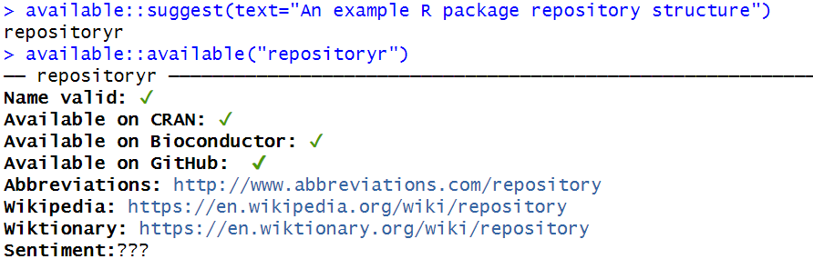

<!-- README.md is generated from README.Rmd. Please edit that file -->

```{r, include = FALSE}
knitr::opts_chunk$set(
  collapse = TRUE,
  comment = "#>",
  fig.path = "man/figures/README-",
  out.width = "100%"
)
```

# repositoryr

<!-- badges: start -->
<!-- badges: end -->

The goal of repositoryr is to provide a step by step guide to creating a R package repository.

## Selecting a package name

To find suggestions on valid package names use `available::suggest(text="description of what the package does")`. You can also check whether the package name is available using `available::available("pkgname")`.

{width=50%}

Alternatively, you can use `pak::pkg_name_check("healthgpsrvis", dictionaries = NULL)`.

{width=50%}

## Creating a package

- In RStudio go to File -> New Project -> New Directory -> R Package. 
- Write the name of the package and select using renv and initialise git. 
- This will create a minimal package structure. 

## Create and connect with a GitHub repository

- Create a new repository on GitHub using the same name as the package. 
- Set the visibility permissions of this repository as suitable but DO NOT initialise this repository with anything. 
- Copy a clone URL of the repository to your clipboard.

More details: [Create and connect a GitHub repo](https://happygitwithr.com/existing-github-last.html#create-and-connect-a-github-repo-without-usethis)

## Connect local repo to GitHub repo

- Click on the “two purple boxes and a white square” in the Git pane. 
- Click “Add remote”. 
- Paste the GitHub repo’s URL here and pick a remote name, say, `origin` and click “Add”.
- Enter main as the branch name and make sure “Sync branch with remote” is checked and click “Create”.

## Connect local repo to GitHub repo with the command line

- In a shell, run the following (substituting with your URL):

```
git remote add origin https://github.com/ImperialCollegeLondon/repositoryr
git push --set-upstream origin main
```

- You should now be able to see all the project files you committed on the GitHub repo browser.


## Using `devtools`

- Install devtools in RStudio using `install.packages("devtools")`.
- It is a set of packages that support various aspects of package development (it includes the `usethis` package too).

## Installation

You can install the development version of repositoryr from [GitHub](https://github.com/) with:

``` r
# install.packages("pak")
pak::pak("ImperialCollegeLondon/repositoryr")
```

## Example

This is a basic example which shows you how to solve a common problem:

```{r example}
library(repositoryr)
## basic example code
```

What is special about using `README.Rmd` instead of just `README.md`? You can include R chunks like so:

```{r cars}
summary(cars)
```

You'll still need to render `README.Rmd` regularly, to keep `README.md` up-to-date. `devtools::build_readme()` is handy for this.

You can also embed plots, for example:

```{r pressure, echo = FALSE}
plot(pressure)
```

In that case, don't forget to commit and push the resulting figure files, so they display on GitHub and CRAN.
