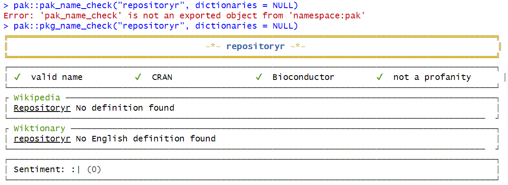

<!-- README.md is generated from README.Rmd. Please edit that file -->

# repositoryr

<!-- badges: start -->
<!-- badges: end -->

The goal of repositoryr is to provide a step by step guide to creating a
R package repository.

## Requirements

- RStudio installed: You will need R and RStudio both installed. You can
  do so either by:

  - Download [RStudio Desktop](https://posit.co/downloads/) OR
  - Use [Posit Cloud](https://posit.cloud/) (online) OR
  - Install it via Chocolatey (first install R using
    `choco install r.project` and then RStudio using
    `choco install r.studio`) OR
  - Install it via Homebrew.

## Selecting a package name

Install the package `available` in RStudio using
`install.packages("available")`. To find suggestions on valid package
names use
`available::suggest(text="description of what the package does")`. You
can also check whether the package name is available using
`available::available("pkgname")`.

<figure>

<figcaption aria-hidden="true">Using available package</figcaption>
</figure>

Alternatively, you can use
`pak::pkg_name_check("healthgpsrvis", dictionaries = NULL)`. (Note: To
install `pak`, use `install.packages("pak")`).

<figure>

<figcaption aria-hidden="true">Using pak package</figcaption>
</figure>

## Creating a package

- In RStudio go to File -\> New Project -\> New Directory -\> R Package.
- Write the name of the package and select using renv and initialise
  git.
- This will create a minimal package structure.

## Create and connect with a GitHub repository

- Create a new repository on GitHub using the same name as the package.
- Set the visibility permissions of this repository as suitable but DO
  NOT initialise this repository with anything.
- Copy a clone URL of the repository to your clipboard.

More details: [Create and connect a GitHub
repo](https://happygitwithr.com/existing-github-last.html#create-and-connect-a-github-repo-without-usethis)

## Connect local repo to GitHub repo

- Click on the “two purple boxes and a white square” in the Git pane.
- Click “Add remote”.
- Paste the GitHub repo’s URL here and pick a remote name, say, `origin`
  and click “Add”.
- Enter main as the branch name and make sure “Sync branch with remote”
  is checked and click “Create”.

## Connect local repo to GitHub repo with the command line

- In a shell, run the following (substituting with your URL):

<!-- -->

    git remote add origin https://github.com/ImperialCollegeLondon/repositoryr
    git push --set-upstream origin main

- You should now be able to see all the project files you committed on
  the GitHub repo browser.

## Using `devtools`

- Install devtools in RStudio using `install.packages("devtools")`.
- It is a set of packages that support various aspects of package
  development (it includes the `usethis` package too).

## Using `devtools::check()`

- At this stage, you can try `devtools::check()` to see if there are any
  issues with the package.
- It should raise an issue about missing/non-standard license in the
  `DESCRIPTION` file. It will be fixed soon!

## Update `DESCRIPTION` file

- The `DESCRIPTION` file contains the metadata of your package. You can
  add some descriptive text about your package under `Title` and
  `Description` fields. You can also fill in the author and maintainer
  details.
- Manually add BSD-3-Clause license (recommended) first to your
  repository and then to the `DESCRIPTION` file.
- Run `devtools::check()` to verify if everything works (As of now, it
  raises a note “Licence stub is invalid DCF.”)

## Add R files and corresponding unit tests

- Create a R function file using `usethis::use_r("filename")`.
- A `filename.R` file will be created under the `R/` directory which you
  can populate.
- Create a corresponding unit test file using
  `usethis::use_test("filename")`.
- A `test-filename.R` file will be created under the `tests/testthat/`
  directory where you can add the unit tests.

## Create website for your package

- Run `install.packages("pkgdown")`.
- To configure the package to use and deploy pkgdown, run
  `usethis::use_pkgdown_github_pages()`.
- To preview your site locally before publishing, run
  `pkgdown::build_site()`.
- This will add the necessary components and sets up GitHub Actions for
  automatic site building when deploying.
- Your `README.md` becomes the homepage, documentation in `man/`
  generates a function reference, and vignettes will be rendered into
  `articles/`.

## Installation

You can install the development version of repositoryr from
[GitHub](https://github.com/) with:

``` r
# install.packages("pak")
pak::pak("ImperialCollegeLondon/repositoryr")
```

## Example

This is a basic example which shows you how to solve a common problem:

``` r
library(repositoryr)
## basic example code
```

What is special about using `README.Rmd` instead of just `README.md`?
You can include R chunks like so:

``` r
summary(cars)
#>      speed           dist       
#>  Min.   : 4.0   Min.   :  2.00  
#>  1st Qu.:12.0   1st Qu.: 26.00  
#>  Median :15.0   Median : 36.00  
#>  Mean   :15.4   Mean   : 42.98  
#>  3rd Qu.:19.0   3rd Qu.: 56.00  
#>  Max.   :25.0   Max.   :120.00
```

You’ll still need to render `README.Rmd` regularly, to keep `README.md`
up-to-date. `devtools::build_readme()` is handy for this.

You can also embed plots, for example:


In that case, don’t forget to commit and push the resulting figure
files, so they display on GitHub and CRAN.
